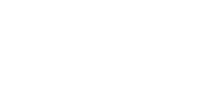

<p align="center">
  
</p>

<p align="center">
  <strong>Zero-Knowledge Anonymous Chat with Cryptographic Accountability on Logos Basecamp</strong>
  <br />
</p>

<p align="center">
  <a href="LICENSE"></a>
  
  
</p>

---

## Overview

**eCloak** is a flagship decentralized, anonymous communication client engineered for **Logos Basecamp**. It resolves the historic Web3 dilemma between absolute privacy and community safety through a breakthrough cryptographic principle:

> **"Privacy by Default, Accountability by Math."**

All conversations are end-to-end encrypted and author-unlinkable using **Zero-Knowledge Nullifier Secret Keys (NSK)** and **Two-Tier Shamir Secret Sharing (SSS)**. If malicious actors repeatedly violate room policies, designated moderators can collaboratively execute **Lagrange polynomial de-anonymization and on-chain collateral slashing** over GF($2^8$) without exposing the identities of honest members or relying on central authorities.

---

## Key Features

1. **Zero-Knowledge Identity Vault (`IdentityModal.qml`)**:
   - Generates and manages 32-byte Nullifier Secret Keys (NSK) and commitments ($\text{SHA256}(\text{NSK})$).
   - Off-chain pseudonymous username registration with Schnorr signature authentication.
   - Real-time telemetry connection to the **Logos Execution Zone (LEZ)** testnet.
   - Complete unlinkability from public on-chain wallet addresses.

2. **Modern 4-Column Responsive Layout**:
   - **Server Rail**: Intuitive navigation across chat rooms, anonymous direct messages (DMs), and identity management.
   - **Channel Sidebar**: Room channel directory and active direct messaging threads.
   - **Chat Area**: High-performance message feed displaying cryptographic tracing tags and SSS share counts.
   - **Right Drawer**: Room telemetry, active moderator consensus status ($N$-of-$M$), and the real-time **Slashing Radar**.

3. **Cryptographic Room Governance (`CreateRoomModal.qml` & `JoinRoomModal.qml`)**:
   - Deterministic room ID derivation based on admin commitment and moderator public keys.
   - Cryptographically signed join-consent requests auto-verified via FFI.
   - Room maturity validation and active member tracking.

4. **Two-Tier Shamir Secret Sharing Messaging**:
   - Outgoing messages are split into encrypted shares targeted at room moderators via ECDH (secp256k1).
   - Tracing tags ensure cryptographic auditability without leaking plaintext contents.

5. **Threshold Moderation & Lagrange Slashing (`StrikeModal.qml`)**:
   - Multi-signature moderator strike certificates with cryptographic evidence hashes.
   - Tier-1 reconstruction from $N$ moderator shares over GF($2^8$).
   - Tier-2 full NSK reconstruction and collateral burning when repeated offenses reach threshold $K$.

---

## System Architecture

```
┌─────────────────────────────────────────────────────────┐
│                      eCloak UI                          │
│            (Logos Basecamp QML Frontend)                │
│                                                         │
│   ServerRail │ ChannelSidebar │ ChatArea │ RightDrawer  │
│         ▲            ▲             ▲           ▲        │
│         └────────────┴──────┬──────┴───────────┘        │
│                             │                           │
│                   Logos Basecamp IPC                    │
│             logos.callModule("el_anon_chat_core", ...)  │
└─────────────────────────────┼───────────────────────────┘
                              ▼
┌─────────────────────────────────────────────────────────┐
│                   el-anon-chat-core                     │
│                  (C++ Qt Plugin / FFI)                  │
│                                                         │
│      ├── e_identity_sdk.so    (Rust Cryptographic Core) │
│      └── e_moderation_sdk.so  (GF(2^8) & SSS Engine)    │
└─────────────────────────────┼───────────────────────────┘
                              ▼
┌─────────────────────────────────────────────────────────┐
│            Logos Execution Zone (LEZ Testnet)           │
│                                                         │
│   • membership_registry.bin (RISC Zero zkVM Program)    │
│   • On-chain Collateral Staking & Slashing Enforcement  │
└─────────────────────────────────────────────────────────┘
```

---

## Directory Structure

```
eCloak/
├── LICENSE                 # Business Source License 1.1 (BSL 1.1)
├── metadata.json           # Basecamp UI module manifest (ecloak)
├── flake.nix               # Nix packaging definition with logos-module-builder
├── README.md               # Product architecture & developer documentation
├── assets/                 # Brand assets & logos
│   ├── EviceLogo-white.png
│   └── EviceLogo-removebg.png
└── qml/
    ├── Main.qml            # Primary application container & IPC coordinator
    ├── components/
    │   ├── ServerRail.qml        # Column 1: Server & navigation rail
    │   ├── ChannelSidebar.qml    # Column 2: Channel & direct message list
    │   ├── ChatArea.qml          # Column 3: Active conversation & feed wrapper
    │   ├── MessageFeed.qml       # Message stream renderer
    │   ├── MessageItem.qml       # Message bubble with tracing tag badge
    │   ├── ChatComposer.qml      # SSS-encrypted message composer
    │   ├── RightDrawer.qml       # Column 4: Metadata & Slashing Radar
    │   ├── UserProfileBar.qml    # Floating user profile & commitment badge
    │   └── Theme.qml             # Centralized design tokens & styling
    └── modals/
        ├── IdentityModal.qml     # Zero-Knowledge Identity Vault
        ├── CreateRoomModal.qml   # Room creation dialog
        ├── JoinRoomModal.qml     # Room join consent dialog
        └── StrikeModal.qml       # Moderator strike & slashing panel
```

---

## Build & Run Instructions

### Prerequisites
- [Nix](https://nixos.org/download.html) with flakes and `nix-command` enabled.
- Access to the Logos Module Builder environment.

### Build the QML Module
```bash
nix build .#
# or
nix build
```

### Build Basecamp Distribution Package (`.lgx`)
```bash
nix build .#lgx
```

### Run in Standalone / Development Mode
```bash
nix run --impure
```

---

## Security & Audit

eCloak is designed with formal cryptographic verification in mind:
- **Math Verification:** Two-Tier Shamir Secret Sharing polynomials are evaluated over GF($2^8$) with verified Lagrange interpolation.
- **Auditable Scope:** Clean, modular FFI boundary between frontend QML, C++ plugin, and Rust guest programs.

---

## License

This project is licensed under the **Business Source License 1.1 (BSL 1.1)**.
- **Free for non-commercial use**, evaluation, personal privacy, academic research, and public security audits.
- **Commercial deployment or SaaS hosting** requires a commercial license agreement from **Evice Labs**.
- Effective **September 12, 2029**, this work converts automatically to the **Apache License, Version 2.0**.

See the full [LICENSE](LICENSE) file for terms and conditions.

---

<p align="center">
  Copyright &copy; 2026 <strong>Evice Labs</strong>. All rights reserved.
</p>
